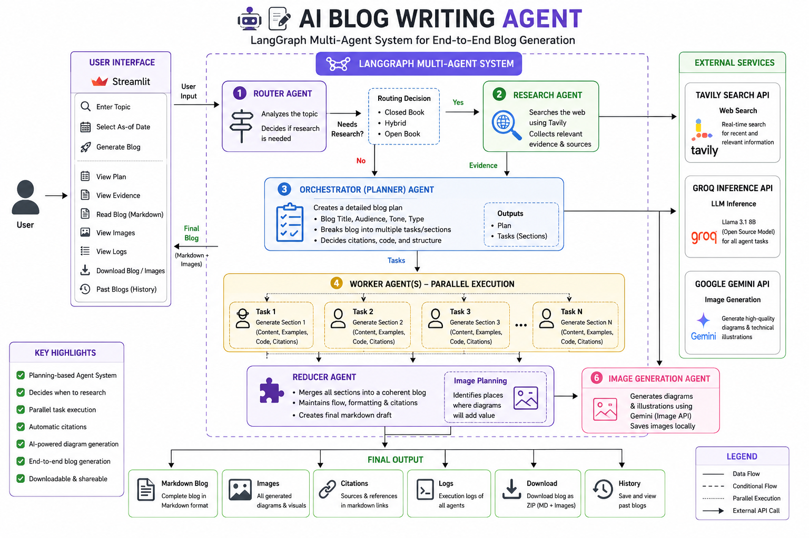
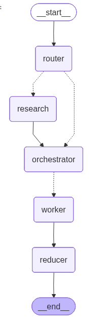
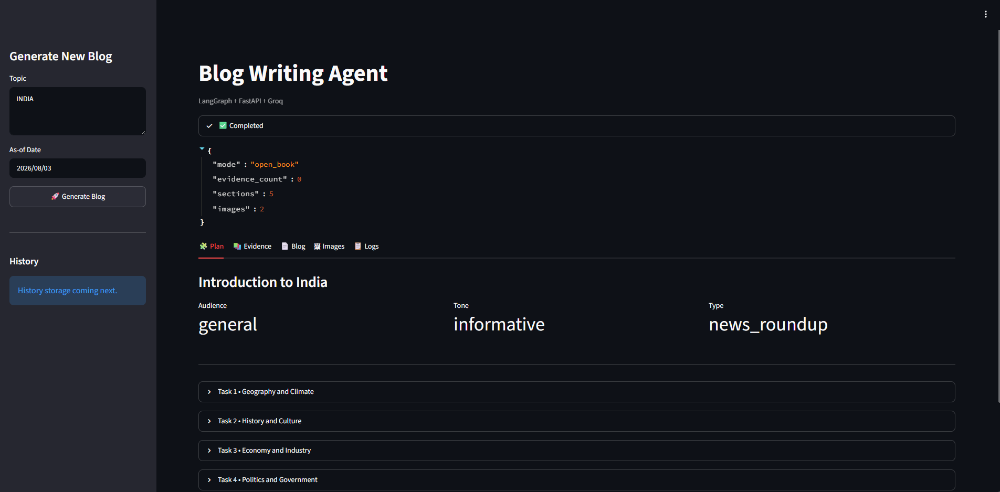

# AI Blog Writing Agent using LangGraph

[](https://python.org)
[](https://github.com/langchain-ai/langgraph)
[](https://python.langchain.com/)
[](https://groq.com/)
[](https://streamlit.io/)
[](https://tavily.com/)
[](https://ai.google.dev/)

A production-style **AI Blog Writing Agent** built using **LangGraph** that demonstrates how modern AI agents are designed beyond simple prompt engineering.

Instead of sending one large prompt to an LLM, this application follows a **planning-based multi-agent architecture**. The system first decides whether internet research is required, plans the complete blog structure, distributes work across multiple worker agents, gathers research evidence, automatically generates technical diagrams, inserts citations, and finally produces a polished Markdown blog.

The entire workflow is orchestrated using **LangGraph's Orchestrator–Worker Architecture**, while **Llama 3.1 8B** (served through Groq) powers every agent with specialized prompts for different responsibilities.

---

#  Features

### Intelligent Task Routing

Before writing a blog, the Router Agent analyzes the topic and decides whether external research is required.

The router automatically chooses between:

- Closed Book Mode
- Hybrid Mode
- Open Book Mode

This prevents unnecessary web searches while ensuring recent topics always include up-to-date information.

---

### 📋 AI Blog Planning

Instead of directly generating a blog, the Planner Agent creates a complete execution plan.

The planner determines:

- Blog Title
- Audience
- Writing Style
- Blog Type
- Section Breakdown
- Research Requirements
- Citation Requirements
- Code Requirements

This planning stage allows the system to generate structured, coherent blogs.

---

### 👨‍💻 Parallel Worker Agents

Once the plan is created, multiple Worker Agents execute tasks independently.

Each worker is responsible for generating one section of the blog.

Workers can independently generate:

- Technical explanations
- Code snippets
- Practical examples
- Markdown content
- Source citations

The generated sections are later combined into one complete article.

---

### 🌍 Automatic Internet Research

For topics requiring recent information, the application automatically:

- Creates optimized search queries
- Searches the web using Tavily
- Collects trusted sources
- Removes duplicate results
- Supplies evidence to the writing agents

This enables the system to produce blogs grounded in recent information instead of relying only on model knowledge.

---

### 🖼️ AI Diagram Generation

The application automatically decides whether technical diagrams or illustrations would improve the article.

When required, it:

- Creates image prompts
- Generates technical diagrams
- Inserts images directly into the Markdown
- Adds captions automatically

---

### 📑 Automatic Citations

Whenever external information is used, the system automatically includes citations and source links inside the generated article.

---

### 📂 Blog Export

Generated blogs can be downloaded as:

- Markdown (.md)
- ZIP Bundle (Markdown + Images)

---

### 📚 Blog History

Previously generated blogs can be loaded directly from the application without generating them again.

---

# 🏗️ Architecture



The application follows LangGraph's **Orchestrator–Worker Architecture**, where specialized agents collaborate to complete a complex writing task.

---

# 🔄 Workflow



The application follows a multi-agent execution pipeline.

### 1. Router Agent

Analyzes the topic and decides whether internet research is required.

↓

### 2. Research Agent

Collects relevant information from the web using Tavily whenever external knowledge is needed.

↓

### 3. Planner Agent

Creates the complete execution plan for the blog.

↓

### 4. Worker Agents

Multiple workers independently generate different sections of the blog.

↓

### 5. Reducer Agent

Combines all generated sections into a single Markdown document.

↓

### 6. Image Planner

Determines whether technical diagrams should be added.

↓

### 7. Image Generator

Generates diagrams and inserts them into the article.

↓

### 8. Final Blog

Produces a complete Markdown blog containing:

- Structured content
- Technical diagrams
- Source citations
- Downloadable assets

---

# 💻 Application Preview



The application allows users to:

- Enter any blog topic
- Generate AI-written blogs
- View the execution plan
- Inspect research evidence
- Preview Markdown output
- Download generated blogs
- Download generated images
- View execution logs
- Reload previous blogs

---

# 🧩 Multi-Agent Architecture

This project demonstrates how multiple AI agents collaborate to solve a complex task.

The system contains:

- Router Agent
- Research Agent
- Planner Agent
- Worker Agents
- Reducer Agent
- Image Planning Agent
- Image Generation Agent

Although every agent uses the same **Llama 3.1 8B** model through Groq, each performs a completely different responsibility using specialized prompts and structured outputs.

This makes the application a **Multi-Agent AI System**, not simply a chatbot with a single prompt.

---

# 🛠️ Tech Stack

## AI Framework

- LangGraph
- LangChain

## LLM

- Llama 3.1 8B (Groq)

## Research

- Tavily Search API

## Image Generation

- Google Gemini

## Frontend

- Streamlit

## Backend

- Python

---

# 📂 Project Structure

```text
AI-Blog-Agent
│
├── assets/
├── images/
├── app.py
├── bwa_backend.py
├── requirements.txt
└── README.md
```

---

# 🔮 Future Improvements

- Human-in-the-loop editing
- Multi-LLM routing
- SEO optimization
- WordPress publishing
- LinkedIn publishing
- PDF export
- Multi-language blogs
- Voice-based blog generation

---

# 👨‍💻 Author

**Anirudh Yadav**

GitHub: https://github.com/ANIRUDH1YADAV
